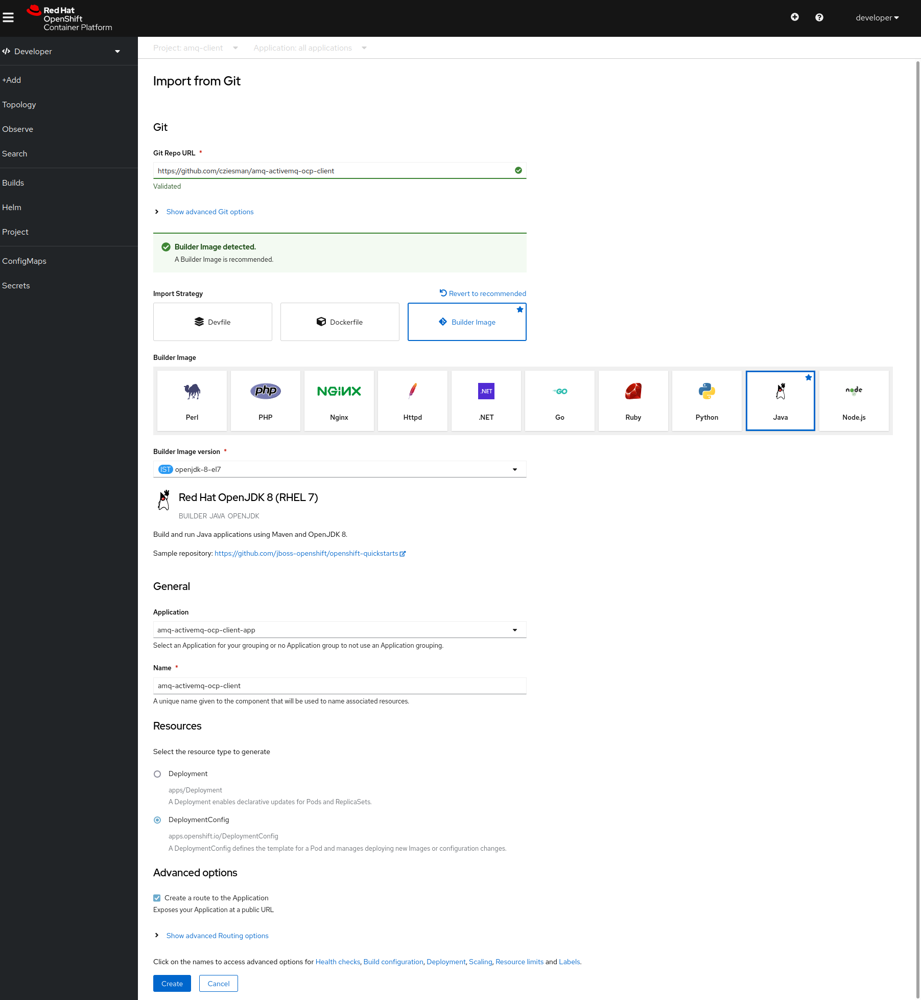

# amq-activemq-ocp-client

To run this application on OCP, you will need to perform the following configuration steps.

## Add a new application

Create a new project on OCP called `amq-client`.

Use the `Developer` view on the OCP web console to add a new application. Select `Import from Git` to use the
code in this repository, which can be found on Github at https://github.com/cziesman/amq-activemq-ocp-client.
Note that the Builder Image Version should be set to `openjdk-8-el7` for now to reduce the risk of
incompatibility when dealing with certificates.

The following screenshot illustrates the typical configuration for a Git build. 

Follow the prompts to create the application. Make sure that you select a resource type of 
`DeploymentConfig` instead of the default `Deployment`. The `Create a route to the Application` checkbox
must be checked. Click the `Create` button. A build will start and the application will deploy automatically
after a few minutes when the build completes.

After the application build has completed, deployment will fail because the trust store needed to create a
connection using SSL has not been configured. The following section describes the necessary steps to make a
trust store accessible to the AMQ client application.

## Configure a trust store for one-way TLS.

The following steps assume that the certificate is the same one that was used to configure SSL on the 
AMQ broker.

Generate a self-signed certificate or export a certificate from a CA in JKS format.

    keytool -genkey -alias broker -keyalg RSA -keystore broker.ks

Export the certificate from the broker key store, so that it can be shared with clients.

    keytool -export -alias broker -keystore broker.ks -file broker_cert.pem

Create a client trust store that imports the broker certificate.

    keytool -import -alias broker -keystore client.ts -file broker_cert.pem

Log in to OCP and select the `amq-client` namespace.

    oc project amq-client

Create a secret `ex-aao-amq-secret` from the keystore that you created.

    oc create secret generic ex-aao-amq-secret --from-file=broker.ks=broker.ks --from-file=client.ts=broker.ks --from-literal=keyStorePassword=<password> --from-literal=trustStorePassword=<password>

Add the secret to the deployment config.

    oc set volume dc/amq-activemq-ocp-client --add --name=ex-aao-amq-secret --type=secret --secret-name='ex-aao-amq-secret' --mount-path=/client/certs

## Configure the application to use the broker service.

The default configuration of the application connects via the external route for the AMQ broker, e.g.,

    ssl://ex-aao-amqp-0-svc-rte-amq-broker.apps-crc.testing:443

Since the client application is deployed in OCP with visibility to the broker service, it can use the broker's
internal service address instead. The hostname is formed by concatenating the broker's service name
(`ex-aao-amqp-0-svc`) with its namespace name (`amq-broker`), and by using the port number (`5672`) 
specified in the `acceptor` in the broker's configuration.

    ssl://ex-aao-amqp-0-svc.amq-broker:5672

This will allow message traffic to avoid the processing overhead imposed by the external route.

In order to use the service address, we need to update the deployment config to use the `openshift` profile.

    oc set env dc/amq-activemq-ocp-client JAVA_OPTIONS="-Dspring.profiles.active=openshift"

This will cause Spring to read the necessary values from the `application-openshift.properties` file.
The client application will redeploy automatically, and the new instance will connect to the AMQ broker 
using the service address instead of the external route.